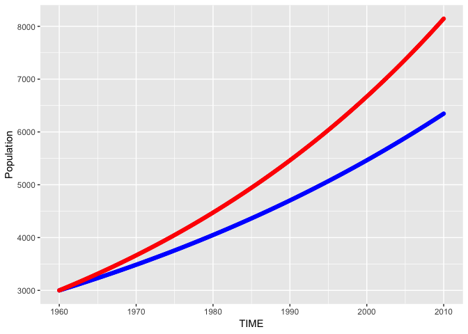

pysd2r
================

<!-- README.md is generated from README.Rmd. Please edit that file -->
An R wrapper for pysd, using the CRAN reticulate package.

The goal of this package is to allow R users run system dynamics models using [pysd](https://pysd.readthedocs.io/en/master/), (designed and developed by [James Houghton](https://github.com/JamesPHoughton)). The pysd project "is a simple library for running System Dynamics models in python, with the purpose of improving integration of Big Data and Machine Learning into the SD workflow."

The pysd system must be installed before installing this package: [see pysd installation instructions](https://pysd.readthedocs.io/en/master/installation.html)

pysd2r has been tested with python3, and the following command was used to install pysd from source.

[Source link:](https://github.com/JamesPHoughton/pysd)

**python3 setup.py install**

Given R's facility for also providing big data and machine learning support, this package opens up the functionality of pysd for R users, and provides an interface to the basic set of methods provided by pysd, including the functions:

-   pysd.read\_vensim()
-   model.run()

The API provide by pysd2r includes the following functions (for list of parameters type ?*function\_name* in R) which call the mapping functions in pysd.

-   **get\_python\_info()** - Returns the python version currently used by reticulate
-   **pysd\_connect()** - Creates an object to facilitate interaction with pysd
-   **read\_vensim()** - Loads a Vensim simulation file (mdl)
-   **read\_xmile()** - Loads a XMILE simulation file (.xmile)
-   **run\_model()** - Runs a simulation model
-   **set\_components()** - Changes a model parameter
-   **get\_timestep()** - Gets the time step (DT) from the model
-   **get\_initial\_time()** - Gets the initial time from the model
-   **get\_final\_time()** - Gets the final time from the model
-   **set\_time\_values()** - Sets the initial time, final time, and timestep
-   **print()** - Implementation of generic print function of ipysd S3 object
-   **get\_doc()** - Gets the model variables and returns as a tibble
-   **reload\_model()** - Reloads the original mdl file

Installation
------------

You can install pysd2r from github with:

``` r
# install.packages("devtools")
devtools::install_github("JimDuggan/pysd2r")
```

Two Examples
------------

The following example shows how pysd2r can be used to run a simulation model (Population.mdl which is a one-stock Vensim model of population growth).

``` r
## basic example code
library(pysd2r)
#> Welcome to package pysd2r.
library(ggplot2)


target <- system.file("models/vensim", "Population.mdl", package = "pysd2r")

py <- pysd_connect()

py <- read_vensim(py, target)

results <- run_model(py)

l <- list("Growth Fraction"=0.02)

set_components(py,l)
out2 <- run_model(py)

ggplot(data=results)+
  geom_point(aes(x=TIME,y=Population),colour="blue")+
  geom_point(data=out2,aes(x=TIME,y=Population),colour="red")
```



The following example shows how pysd2r can be used to run an ensemble of simulations.

``` r
library(pysd2r)
library(ggplot2)
library(plyr)
library(dplyr)
#> 
#> Attaching package: 'dplyr'
#> The following objects are masked from 'package:plyr':
#> 
#>     arrange, count, desc, failwith, id, mutate, rename, summarise,
#>     summarize
#> The following objects are masked from 'package:stats':
#> 
#>     filter, lag
#> The following objects are masked from 'package:base':
#> 
#>     intersect, setdiff, setequal, union

target <- system.file("models/vensim", "Population.mdl", package = "pysd2r")

gr <- seq(0.01,0.04,by=0.0025)

py <- pysd_connect()
py <- read_vensim(py, target)

ans <- lapply(gr, function (g){
  l <- list("Growth Fraction"=g)
  set_components(py,l)
  out     <- run_model(py)
  out$Key <- paste0("GR=",g)
  out     <- select(out,TIME,Population,Key)
})

full <- rbind.fill(ans)

ggplot(data=full)+
  geom_point(aes(x=TIME,y=Population,colour=Key))
```


